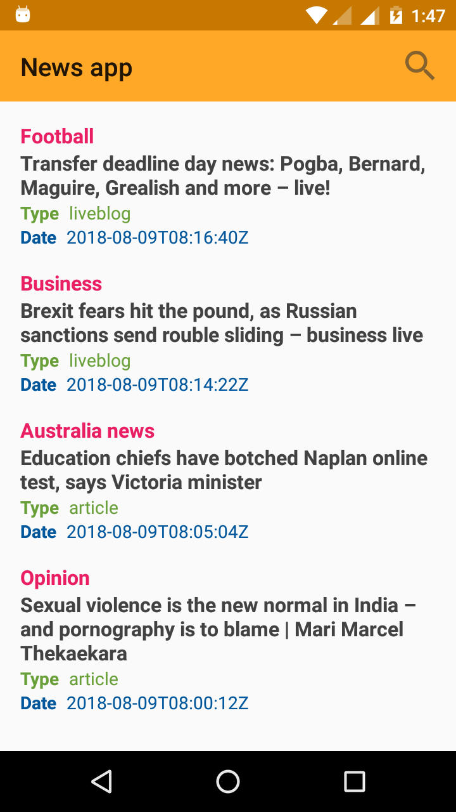
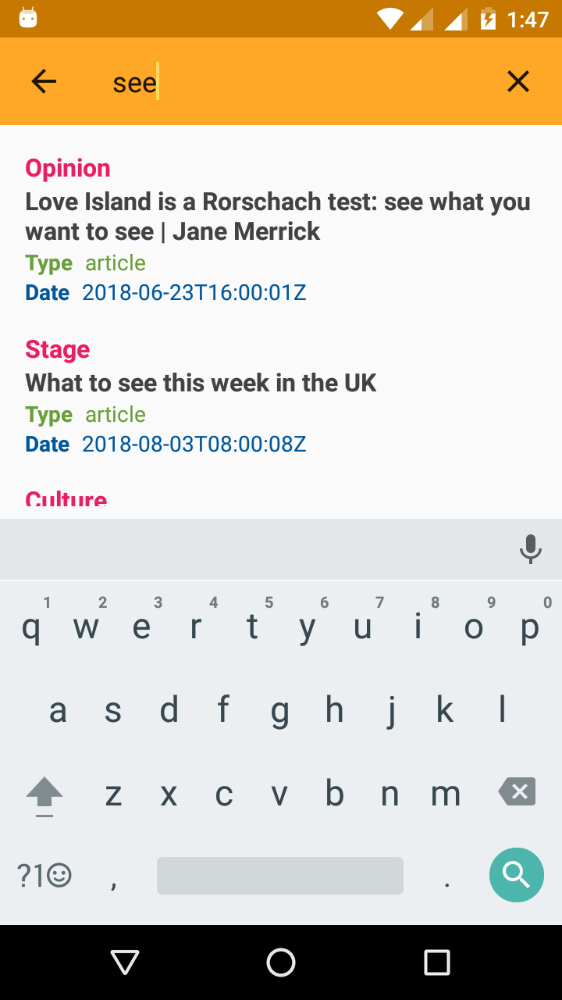

# Simple News app (Android architecture components)

News app Udacity Android Basic Nanodegree Project.That show's News from [Theguardian News api](https://open-platform.theguardian.com/documentation/).

It also show's that How to use Search View in Android.

Check this Link for Udacity Android Basic Nanodegree Projects [Click Here](https://github.com/akueisara/android-basics-nanodegree-by-google).

## Screenshots:-

 
